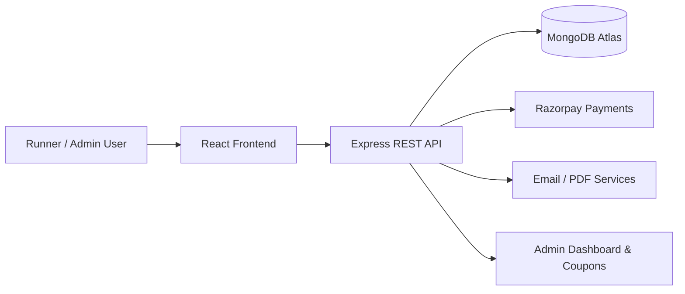

# Sprints Saga India - LokRaja Marathon Platform

🌐 Live Website: [https://www.sprintssagaindia.com](https://www.sprintssagaindia.com)

[](https://react.dev/)
[](https://vite.dev/)
[](https://tailwindcss.com/)
[](https://nodejs.org/)
[](https://expressjs.com/)
[](https://www.mongodb.com/atlas)
[](https://razorpay.com/)
[](https://nodemailer.com/)
[](https://aws.amazon.com/amplify/)
[](https://aws.amazon.com/apprunner/)

Sprints Saga India is a full-stack marathon event platform designed to manage the complete LokRaja Marathon experience from public discovery to registration, secure payments, admin operations, email communication, and event logistics.

The platform provides a polished, responsive customer-facing experience while also giving organizers a powerful backend for registrations, coupon management, analytics, and operational workflows.

## Why This Platform Matters

- Delivers a modern digital experience for runners, volunteers, and organizers.
- Supports multi-category race participation including 5K, 10K, 35K, and Full 42K journeys.
- Combines marketing content, registration, payments, dashboards, and admin operations in one ecosystem.
- Built with production-minded architecture for scalability, maintainability, and real-world event operations.

## Core Features

### Customer Experience
- Responsive event landing experience and marathon information pages.
- Multi-step registration flows for individual and group participation.
- Protected user authentication and session management.
- Secure payment checkout with Razorpay integration.
- Post-registration invoice and confirmation workflows.

### Admin & Operations
- Admin dashboard with registration and user insights.
- Coupon code creation, activation, deactivation, and validation.
- Operational reporting through Excel/CSV-friendly workflows.
- Email and PDF-based confirmation and invoice generation.
- File upload support for identification documents and registration assets.

### Technical Highlights
- Global state management using React Context API.
- Role-aware route protection for users, admins, and volunteers.
- Structured REST API architecture with Express and MongoDB Atlas.
- Real-world integrations for payments, emails, PDF generation, and barcode/QR-related operations.

## Tech Stack

### Frontend
- [](https://react.dev/) for the user interface
- [](https://vite.dev/) for fast development and builds
- [](https://tailwindcss.com/) for responsive styling
- [](https://reactrouter.com/) for client-side routing
- [](https://www.framer.com/motion/) for animation
- [](https://recharts.org/) for analytics charts
- [](https://fkhadra.github.io/react-toastify/) for notifications

### Backend
- [](https://nodejs.org/) for server-side runtime
- [](https://expressjs.com/) for REST API development
- [](https://www.mongodb.com/atlas) for database storage
- [](https://mongoosejs.com/) for schema modeling
- [](https://jwt.io/) for authentication
- [](https://www.npmjs.com/package/bcryptjs) for password hashing
- [](https://github.com/expressjs/multer) for file uploads

### Payments, Messaging & Documents
- [](https://razorpay.com/) for secure payment processing
- [](https://nodemailer.com/) for transactional email delivery
- [](https://pdfkit.org/) for invoice generation
- [](https://sheetjs.com/) for spreadsheet processing

### Hosting & Cloud
- [](https://aws.amazon.com/amplify/) for frontend hosting
- [](https://aws.amazon.com/apprunner/) for backend hosting

## Architecture Overview



## Repository Structure

```text
Sprints-Saga-India/
  frontend/          # React + Vite client application
  backend/           # Node.js + Express API services
  README.md          # Project overview and onboarding guide
```

## Getting Started

### Prerequisites
- Node.js 18+ recommended
- npm or pnpm
- MongoDB Atlas connection details
- Razorpay keys and email service configuration

### 1) Clone the repository

```bash
git clone https://github.com/AbhishekJaiswal6822/Sprints-Saga-India.git
cd Sprints-Saga-India
```

### 2) Frontend setup

```bash
cd frontend
npm install
cp .env.example .env
npm run dev
```

### 3) Backend setup

```bash
cd ../backend
npm install
cp .env.example .env
npm start
```

## Environment Variables

Create environment files in both frontend and backend folders with values appropriate for your environment.

### Frontend
```env
VITE_API_BASE_URL=http://localhost:8000
```

### Backend
```env
PORT=8000
MONGO_URI=your_mongodb_connection_string
JWT_SECRET=your_jwt_secret
NODE_ENV=development
CORS_ORIGIN=http://localhost:5173
RAZORPAY_KEY_ID=your_razorpay_key_id
RAZORPAY_KEY_SECRET=your_razorpay_key_secret
EMAIL_USER=your_email_address
EMAIL_PASS=your_email_password
```

## Deployment

The platform is designed for production deployment with:
- Frontend hosted on AWS Amplify
- Backend hosted on AWS App Runner
- Database managed through MongoDB Atlas
- Email communications routed through secure mail services such as Zoho

## Project Highlights

- Modern responsive event portal
- Secure authentication and role-based access
- Advanced registration and payment workflows
- Admin coupon and dashboard management
- Automated invoicing and communication workflows
- Structured and extensible API foundation

## Contributing

Contributions are welcome. For significant changes, please open an issue first to discuss the proposed improvement.

## License

This project is intended for internal and commercial event platform use. Please review repository ownership and usage terms before redistribution.
